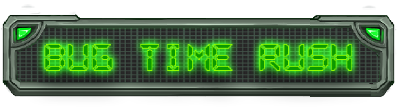

A game about a developer who has fallen on the digital world to solve his conflicting errors on his source code.

# Developing 
```
git clone https://github.com/lezzthanthree/BugTIMERush.git
```

This also needs pytmx  and pygame package to compile the game.

```
pip install pytmx
```
```
pip install pygame
```

## Compiling
```
pyinstaller main.py  --onefile --noconsole --icon=icon.ico
```
The assets (img, snd, and lvl folders) also needs to be moved inside the `dist` folder to work.